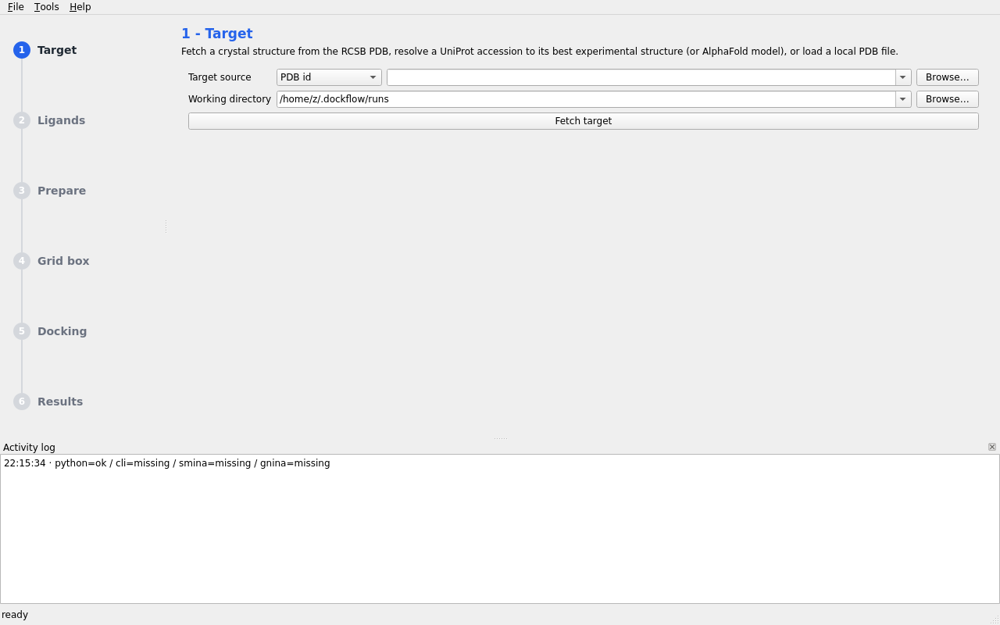

# DockFlow-Automator

**Unified, automated molecular docking: target/ligand download → preparation → grid box → docking → 3D visualization — end to end.**

[](https://github.com/oualid-razzok/DockFlow-Automator/actions/workflows/build.yml)
[](https://www.python.org)
[](BUILD_GUIDE.md)
[](LICENSE)
[](https://github.com/astral-sh/ruff)

**In one sentence:** DockFlow-Automator takes a PDB id and a ligand,
and does everything needed to dock that ligand into that protein with
AutoDock Vina — fetches the structures, prepares them for docking,
defines the search space, runs the docking, analyses the poses against
the crystal structure, renders pictures, and writes a report you can
show a reviewer — without you hand-driving five separate tools.

```text
        +---------+     +----------+     +---------+     +--------+     +----------+     +-----------+
        | download | --> | prepare  | --> | grid    | --> | dock   | --> | analyze  | --> | visualize |
        | target + |     | receptor |     | box     |     | Vina/  |     | contacts |     | PyMOL /   |
        | ligands  |     | + ligand |     |         |     | Smina/ |     | + RMSD + |     | matplotlib|
        |          |     | (Meeko)  |     |         |     | GNINA  |     | clusters |     |           |
        +---------+     +----------+     +---------+     +--------+     +----------+     +-----------+
             RCSB/PubChem  OpenBabel/RDKit   ligand/      PDBQT poses   geometric      PNG + .pse
             ZINC/UniProt  PDBQT + charges   residues                   contacts,      + report.md
                           + provenance      or explicit                crystal RMSD   + manifest.json
```

Under the hood it wraps the modern scientific-docking stack
([AutoDock Vina](https://github.com/ccsb-scripps/AutoDock-Vina),
[Meeko](https://github.com/forlilab/Meeko),
[RDKit](https://www.rdkit.org),
[OpenBabel](https://github.com/openbabel/openbabel) and
[open-source PyMOL](https://github.com/schrodinger/pymol-open-source))
into one reproducible workflow with interchangeable front ends:

| front end | audience | entry point |
|---|---|---|
| **Desktop GUI** (PyQt6) | medicinal chemists, students | `dockflow-gui` |
| **CLI** | scripters, HPC users | `dockflow <command>` |
| **Python API / pipeline** | developers, automation | `DockingPipeline` |
| **Docker image** | reproducibility | `docker run dockflow-automator` |

**Runs on Linux, Windows and macOS** — one-command installers and
double-click launchers are included for all three
(`scripts/install_tools.sh`, `scripts/install_tools.ps1`,
`run_dockflow.bat` / `run_dockflow.command` / `run_dockflow.sh`); see
[**BUILD_GUIDE.md**](BUILD_GUIDE.md) to compile and install, and
[**USER_GUIDE.md**](USER_GUIDE.md) for the full usage manual.

> The automation style follows the spirit of
> [`omicscodeathon/anticrcwu`](https://github.com/omicscodeathon/anticrcwu)
> (event-driven, fully scripted workflows), while the *chemistry* follows the
> classic MGLTools logic — `prepare_receptor4.py` / `prepare_ligand4.py` —
> reimplemented on maintained toolkits (the legacy MGLTools/AD4 python-2
> stack is intentionally **not** used; Meeko + RDKit + OpenBabel replace it
> with the same parameterization semantics).

---

## Table of contents

1. [Features](#features)
2. [Quick start](#quick-start)
3. [Validated example: 1HVR redocking](#validated-example-1hvr-redocking)
4. [Scientific validation vs software tests (item: what "tested" means)](#scientific-validation-vs-software-tests-item-what-tested-means)
5. [Scientific limitations and assumptions](#scientific-limitations-and-assumptions)
6. [Known scientific differences per preparation engine](#known-scientific-differences-per-preparation-engine)
7. [Pipeline stages explained](#pipeline-stages-explained)
8. [Architecture](#architecture)
9. [Repository layout](#repository-layout)
10. [C++ accelerator bindings](#c-accelerator-bindings)
11. [Docker](#docker)
12. [Python API examples](#python-api-examples)
13. [Configuration reference](#configuration-reference)
14. [Testing & development](#testing--development)
15. [Licenses & third-party components](#licenses--third-party-components)
16. [Troubleshooting](#troubleshooting)
17. [Roadmap](#roadmap)
## Features

**Automated end-to-end workflow** — one YAML file (or one GUI session) drives
structure download, ligand acquisition, receptor/ligand preparation, search-space
definition, AutoDock Vina docking, interaction analysis, rendering and reporting.

- **Target acquisition**: RCSB PDB entries by id, UniProt accessions resolved
  through the PDBe API to their best experimental structure, or AlphaFold
  predicted models; local files are first-class citizens.
- **Ligand acquisition**: PubChem (name / CID / SMILES), ZINC22, RCSB chemical
  components (ideal 3D coordinates), local SDF/MOL2/PDB/PDBQT/SMILES files,
  or plain SMILES strings with on-the-fly ETKDG 3D embedding.
- **Receptor preparation** (`prepare_receptor4.py` logic, modern toolkits):
  chain selection, alternate-location resolution (best-occupancy or explicit),
  water/heteroatom filtering with metal retention, hydrogen addition,
  Gasteiger partial charges, non-polar hydrogen merging (united atoms),
  AutoDock atom typing (A/NA/OA/SA/HD/...), PDBQT output. Four interchangeable
  engines: OpenBabel bindings → RDKit → `obabel` CLI → dependency-free fallback.
- **Ligand preparation** (`prepare_ligand4.py` logic via Meeko + RDKit):
  sanitisation, salt stripping, largest-fragment selection, ETKDGv3 3D
  embedding, MMFF94/UFF minimisation, optional dimorphite-dl protonation
  states, torsion-tree PDBQT.
- **Grid box**: derived from the co-crystallized ligand, from active-site
  residues, or explicit; exported/imported as Vina config files; live 3D
  preview in the GUI (rotate/zoom, no OpenGL required).
- **Docking**: official Vina **python bindings**, the **vina CLI**,
  **Smina**, or **GNINA** (CNN scoring, Apache-2.0) — selected
  automatically. Batch docking across ligands with progress callbacks,
  cancellation and **crash-safe checkpoint/resume** (`progress.json`,
  `--force` to re-dock), `--score-only` / `--local-only` modes,
  vina / vinardo / ad4 scoring.
- **Analysis**: pose parsing, per-pose binding affinities and RMSD tables,
  geometric contact classification (H-bond contacts, hydrophobic, ionic,
  metal — distance+type criteria, documented in
  `docs/interaction_criteria.md`), residue "hotspot" tables, pose
  clustering summaries, **redocking validation** (symmetry-tolerant
  heavy-atom `crystal_rmsd` to the co-crystallized pose with a
  PASS/FAIL banner), `docking_score_efficiency` (score-per-heavy-atom
  proxy, explicitly not experimental ligand efficiency), CSV/JSON export
  with a JSON Schema (`docs/schemas/`), docked poses exported to SDF
  with score SD fields, plus post-run **interaction fingerprints**
  (`dockflow ifp`: Tanimoto similarity + pose clustering) and
  **consensus pose ranking** (`dockflow rank`: score + IFP + geometry,
  weights echoed in every output — all labelled as heuristics).
- **Enrichment metrics**: `dockflow enrich` computes ROC AUC, EF@1%,
  EF@5% and BEDROC (α=20, RDKit-verified) for actives+decoys panels
  straight from `summary.csv`, with an optional ROC PNG.
- **Visualization**: headless PyMOL (ray-traced PNG + `.pse` sessions + CGO
  wire-frame grid box, in-process or subprocess) with an automatic matplotlib
  fallback renderer for minimal installs; "Open in PyMOL" from the GUI;
  and a **self-contained interactive 3D viewer** (`visualization/`
  `interactive.html`, 3Dmol.js) with pose switching, grid box, contacts
  and crystal overlay for every completed run.
- **Structure quality & advanced protocols**: missing-residue, disulfide,
  reduced-Cys and metal-coordination checks recorded in the manifest;
  Vina two-file **flexible side-chain docking**; GNINA **covalent docking**;
  ligand-state provenance (protonation/tautomers/stereo/salts recorded by
  default, opt-in enumeration via dimorphite-dl and RDKit).
- **Scale**: 100k+ ligand libraries via chunked SDF streaming with
  checkpoint resume (`scripts/batch_dock.py`); slurm array-job templates
  for clusters (`scripts/generate_sbatch.py`, ADR-0007).
- **Reproducibility & provenance**: every run writes a `manifest.json`
  (per-stage audit trail: wall time, ISO start/stop, exit status,
  resolved engine/backend; total `duration_s`), an
  **`environment.json` fingerprint** of the full scientific stack,
  **SHA-256 checksums** of every key input/output file
  (`manifest.checksums`), preparation **decision provenance**
  (engine comparability sets, removed species, ligand state chemistry),
  a markdown `report.md` (results, pose clustering, warnings, and an
  "Assumptions this run made" footer), structured `--log-format json`
  logs; Docker image pins the whole stack; seeds are configurable and
  the CI `reproducibility` workflow asserts same-seed byte-identical
  `summary.csv`; the GUI ships a **first-run tutorial** and exposes the
  same decision provenance the manifest records.

## Quick start

### Install

> **Reproducible science: use Docker or conda.** The plain-pip install
> below works for a *quick smoke test*, but it does not pin the
> scientific stack (Vina/Meeko/RDKit/OpenBabel versions shift
> independently) — for results you intend to trust or publish, use the
> pinned image/environment.  Every run records its exact stack in
> `environment.json` either way.

**Recommended: pinned Docker image** (Linux; image tags map to DockFlow
releases):

```bash
docker build -f docker/Dockerfile -t dockflow-automator:0.2.0 .
docker run --rm -v "$PWD:/data" dockflow-automator:0.2.0 \
    run --config /data/examples/configs/hiv1_protease_example.yaml
```

**Recommended: pinned conda environment** (Linux / macOS / Windows):

```bash
micromamba create -n dockflow -c conda-forge -c bioconda \
    python=3.12 openbabel pymol-open-source autodock-vina
micromamba run -n dockflow pip install "dockflow-automator[prep,engine,gui,viz]"
```

**Quick smoke test (pip only — not for reproducible science):**

Platform support (verified): everything installs from pip on all three OS;
the Vina *python bindings* ship wheels for Linux (cp38–cp312) only, so on
Windows/macOS the equally capable **vina CLI backend** is used (installed
automatically by the scripts below). Details in
[BUILD_GUIDE.md](BUILD_GUIDE.md#2-platform-support-matrix).

| OS | one command | then |
|---|---|---|
| Linux / macOS | `bash scripts/install_tools.sh` | `run_dockflow.sh` / `run_dockflow.command` |
| Windows | `powershell -ExecutionPolicy Bypass -File scripts\install_tools.ps1` | `run_dockflow.bat` |
| any (minimal) | `pip install "dockflow-automator[prep]"` | `dockflow` / `dockflow-gui` |

> **No setup done yet?** Just double-click the launcher for your OS — it
> detects the missing install and offers a one-keypress guided setup
> (full conda stack, or quick pip install + automatic Vina engine
> download).

```bash
# core + ligand/receptor preparation (Meeko + RDKit)
pip install "dockflow-automator[prep]"

# + Vina python bindings (Linux), GUI, fallback renderer
pip install "dockflow-automator[all]"

# everything including OpenBabel wheels and the C++ accelerator
pip install "dockflow-automator[all,obabel]" ./bindings
```

Extras: `[prep]` Meeko+RDKit (+gemmi) · `[obabel]` OpenBabel bindings ·
`[engine]` Vina python bindings · `[gui]` PyQt6 · `[viz]` matplotlib ·
`[test]` pytest/ruff · `[dev]` all of the previous + build.

PyMOL and the Vina CLI are best installed through conda-forge/bioconda
(via `bash scripts/install_tools.sh`, which creates a complete `dockflow`
environment — on Windows use `scripts/install_tools.ps1`, which also fetches
the official Vina 1.2.7 Windows executable — or see [Docker](#docker) for a
pinned image).

```bash
micromamba create -n dockflow -c conda-forge -c bioconda \
    python=3.10 openbabel pymol-open-source autodock-vina
micromamba run -n dockflow pip install "dockflow-automator[prep,engine,gui,viz]"
```



### GUI in 6 steps

```bash
dockflow-gui
```

1. **Target** — type a PDB id (`1HVR`), a UniProt accession, or browse a local
   file; metadata (title, resolution, co-crystal ligands) is fetched and shown.
2. **Ligands** — add SMILES, files, PubChem/ZINC lookups, or pull the
   co-crystallized ligand straight from the target with one click.
3. **Prepare** — one button each for receptor and ligands; engines, chain
   filters and hydrogens are configurable.
4. **Grid box** — "From co-crystal ligand" / "From residues…" or manual
   center/size; the interactive 3D preview updates live.
5. **Docking** — set exhaustiveness/poses/seed and press *Start*; the table
   fills in as ligands finish; *Cancel* actually cancels.
6. **Results** — pose table with affinities, interaction table, "Render PNG",
   "Open in PyMOL", CSV export.

### CLI in 6 commands

```bash
dockflow download pdb     --id 1HVR --out runs/raw
dockflow download ligand  --pdb-ligand XK2 --out runs/raw
dockflow prep receptor    --in runs/raw/1hvr.pdb --out-dir runs/prepared
dockflow prep ligand      --in runs/raw/xk2.sdf --name xk2 --out-dir runs/prepared
dockflow gridbox          --structure runs/raw/1hvr.pdb --resname XK2 --padding 4 \
                           --out runs/gridbox.txt
dockflow dock             --receptor runs/prepared/receptor.pdbqt \
                           --ligands runs/prepared/xk2.pdbqt \
                           --config runs/gridbox.txt --exhaustiveness 16 \
                           --out-dir runs/docking
dockflow analyze          --docking runs/docking --receptor runs/prepared/receptor.pdbqt
dockflow visualize        --receptor runs/prepared/receptor.pdbqt \
                           --poses runs/docking/xk2_out.pdbqt --out runs/render.png
```

`dockflow info` prints a full environment report (installed modules, detected
Vina backends, chosen preparation engine).

### One-file automated run

```bash
dockflow run --config examples/configs/hiv1_protease_example.yaml
```

```yaml
target:
  pdb_id: 1HVR
ligands:
  - id: xk2_redock
    pdb_ligand: XK2        # co-crystal ligand from RCSB
  - id: aspirin_decoy
    pubchem: aspirin
  - id: caffeine_decoy
    smiles: "Cn1cnc2c1c(=O)n(C)c(=O)n2C"
gridbox:
  source: ligand           # from the co-crystallized ligand
  reference_ligand_resname: XK2
  padding: 4.0
docking:
  exhaustiveness: 16
  seed: 2026               # reproducible
visualization:
  enabled: true
```

Each run produces a self-contained directory:

```text
runs/<run_id>/
├── manifest.json        # machine-readable summary (config, timings, results)
├── report.md            # human-readable report with result tables
├── raw/                 # downloaded target + ligands
├── prepared/            # receptor.pdbqt, ligand PDBQTs, clean PDB
├── gridbox.txt          # Vina config of the search space
├── docking/             # *_out.pdbqt, logs, summary.csv
├── analysis/            # interactions.json, per-pose contacts CSVs
├── visualization/       # rendered PNGs (+ .pse sessions)
└── logs/pipeline.log
```

---

## Validated example: 1HVR redocking

A real validation run (Vina 1.2.7 python bindings, exhaustiveness 16,
seed 2026; artifacts committed under `examples/results/1HVR/`):

```text
[1] target    1HVR downloaded from RCSB (co-crystal ligand XK2)
[2] receptor  1890 -> 1846 atoms (OpenBabel engine, +1292 hydrogens)
[3] ligand    XK2 prepared with Meeko (46 heavy atoms, 10 rotatable bonds)
[4] grid box  center (-8.7, 15.5, 27.9), volume 6974 A^3 (pocket:XK2 + 4 A)
[5] docking   9 poses; best -11.13 kcal/mol
[6] analysis  9 poses in 4 clusters; best crystal RMSD 1.08 A (PASS,
              threshold <= 2.0 A) - the co-crystal pose is recovered
[7] contacts  ILE47, ILE50, ALA28, ILE84, ASP25/30 - the canonical
              HIV-1 protease flap/active-site residues
[8] report    report.md + manifest.json + environment.json
```

The example is a *validation*, not a smoke test: the report banner states
the redocking pose recovery, `summary.csv` carries a `crystal_rmsd`
column for every pose, and the CI `reproducibility` workflow re-runs this
config twice with the same seed and byte-compares `summary.csv`.  A
cross-docking example (XK2 docked into a different HIV-1 PR structure,
1HSG) lives at `examples/configs/hiv1_cross_docking_1HSG.yaml`.

## Validation track: measured, not promised (v0.3.0)

All three benchmarks have been **run for real** (nightly CI re-runs them;
see `.github/workflows/nightly.yml`):

| benchmark | result | artifacts |
|---|---|---|
| 24-complex redocking (exh. 8, seed 2026) | **24/24 completed, 18/24 success (75%)**, mean RMSD 1.32 Å / median 0.96 Å | `benchmarks/redocking/results/` |
| DUD-E hivpr enrichment (133 ligands) | **ROC AUC 0.665**, EF@1% 3.33, EF@5% 2.38, BEDROC 0.665 | `benchmarks/enrichment/results/` |
| MGLTools 1.5.7 comparison (same box/seed) | DockFlow 16/21 vs MGLTools 14/21 pose recovery; mean RMSD delta +0.45 Å; 3 genuine MGLTools crashes recorded | `benchmarks/mgltools_comparison/results/` |

Failures are recorded with reasons and full run directories - a
benchmark that drops its failures is not a benchmark.

## Scientific validation vs software tests (item: what "tested" means)

Two different claims must not be conflated:

* **Software tests** — `~250` fast, offline, no network, no real
  docking (`pytest -m "not network and not gui and not scientific"`).
  They pin parsing, typing, CLI contracts, the GUI smoke surface and the
  analytic RMSD/clustering/enrichment maths.  Run on every push, 3 OS ×
  2 Python versions.
* **Scientific validation** — tests that would fail if the *science*
  were wrong, not the code:
  * `pytest -m scientific`: real 1HVR redocking must recover the crystal
    pose within 2.0 A; the same seed must reproduce identical scores;
  * the `reproducibility` workflow: the full example config runs twice,
    `summary.csv` must be byte-identical (documented 1e-6 fallback);
  * `benchmarks/redocking/`: the 24-complex redocking benchmark
    (PDBbind/Astex classics) - **run in full** (see the table above),
    re-run nightly in CI;
  * `benchmarks/mgltools_comparison/`: DockFlow vs the conventional
    MGLTools workflow on the same inputs/box/seed - **run in full**;
  * `benchmarks/enrichment/`: real DUD-E actives/decoys enrichment -
    **run in full**;
  * `docs/preparation_validation.md`: cross-engine preparation numbers
    (atom counts, charges, typing) computed, not asserted.

## Scientific limitations and assumptions

DockFlow-Automator automates a *conventional rigid-receptor Vina
workflow*; every run of that workflow inherits these limitations, and
the run report makes the resolved choices explicit ("Assumptions this
run made" footer in `report.md`):

* **Rigid receptor** — no side-chain or backbone flexibility; induced
  fit is invisible.  Cross-docking into a different conformation can
  fail for this reason.
* **Implicit solvent, no entropy** — Vina scores are empirical
  enthalpy-ish estimates, not free energies; absolute values are not
  comparable across targets, only rankings within one target.
* **Geometric contacts only** — interaction detection uses distance +
  atom type (no angle criterion); see
  [docs/interaction_criteria.md](docs/interaction_criteria.md).  "H-bond
  contact" means donor-acceptor within 3.5 A, not a verified bond.
* **Default protonation** — receptors keep their deposited protonation
  plus toolkit hydrogen addition (pH 7.4 convention); ligands use the
  input state unless `protonate: true` (dimorphite-dl).  Tautomers are
  *not* enumerated; one tautomer in, one tautomer docked.
* **Single reference geometry** — one PDB conformation per target;
  no ensemble averaging.
* **Waters/metals removed by default** — with a recorded warning per
  species (`manifest.receptor.removed`); keep them with
  `receptor.keep_resnames` when they matter (metal-dependent sites).
* **Search space is a box** — pocket-derived with padding, or your
  explicit choice; a bad box is the most common cause of bad docking.
* **Scoring function limits** — Vina 1.2.x empirically parameterised;
  Vinardo/AD4/GNINA-CNN options each shift absolute scores.

Every per-run assumption (engine, charge model, waters, metals, box
source/padding, scoring, ligand protonation source) is recorded in
`manifest.json` under `receptor.decisions`, `ligands[*].prep` and
`gridbox`, because "automatic preparation" must never mean "hidden
preparation".

## Known scientific differences per preparation engine

The `auto` chain is **OpenBabel → RDKit → `obabel` CLI → `none`**, each
falling through with a logged WARNING on failure (a broken optional
dependency never crashes a run).  The engines make *different scientific
decisions* — the outputs are not interchangeable:

| Engine | Hydrogens | Charges | Aromaticity | Notes |
|---|---|---|---|---|
| OpenBabel | added at pH 7.4 | Gasteiger, near-neutral sum | perceived (`A` types) | default on Linux (`openbabel-wheel`) / conda |
| RDKit | added (`AddHs`) | Gasteiger **including residue formal charges** (net ≠ 0) | perceived | default where OpenBabel is unavailable; charge difference is irrelevant for Vina/Vinardo scoring (types+geometry), relevant for AD4 maps |
| `obabel` CLI | same as OpenBabel | same | same | chain ids not carried through MOL2 |
| `none` | **not added** | **0.0 (skipped entirely)** | **not perceived** | dependency-free fallback for CI/testing — geometry-only receptor, scientifically degraded |

Measured numbers for all engines on the 1HVR example live in
[docs/preparation_validation.md](docs/preparation_validation.md).

## Pipeline stages explained

| stage | module | what happens | MGLTools equivalent |
|---|---|---|---|
| download | `dockflow_core.downloader` | RCSB/PDBe/AlphaFold/PubChem/ZINC with retries + cache | — |
| prepare receptor | `dockflow_core.preparator` | filter (chains, altLoc, waters, hetero) → add H → Gasteiger → merge non-polar H → AD4 types → PDBQT | `prepare_receptor4.py` |
| prepare ligand | `dockflow_core.preparator` | RDKit sanitise/3D/minimise → Meeko torsion tree → PDBQT | `prepare_ligand4.py` |
| grid box | `dockflow_core.gridbox` | bounding box + padding from ligand/residues/coords; Vina config I/O | `prepare_gpf`/autogrid notions |
| docking | `dockflow_core.docker_engine` | Vina python / vina CLI / smina; batch, progress, cancel | `vina` runs |
| analysis | `dockflow_core.analyzer` | contacts, hotspots, clustering, Kabsch RMSD, efficiency | — |
| visualization | `dockflow_core.visualizer` | PyMOL `.pml` generation + headless execution, matplotlib fallback | — |
| orchestration | `dockflow_core.pipeline` | event-driven automation, manifests, reports | anticrcwu-style automation |

Receptor option mapping (defaults follow `prepare_receptor4.py`):

| MGLTools flag | DockFlow option | default |
|---|---|---|
| `-A hydrogens` | `ReceptorPrepOptions.add_hydrogens` | `True` |
| `-U nphs` | `merge_nonpolar_h` | `True` |
| `-U lps` | lone pairs dropped | always |
| `-U altloc` | `altloc` (`"best"`/`"A"`/`""`) | `"best"` |
| `-C` chains | `chains` | all |
| `-w` waters | `keep_water` | `False` |
| `-e` no charges | `charge_model="zero"` | `"gasteiger"` |

## Architecture

```text
                ┌─────────────────────────────────────────────────┐
                │                front ends                       │
                │  dockflow-gui (PyQt6)   dockflow CLI   YAML run │
                └───────────────┬─────────────────────────────────┘
                                │  threads / argparse / pipeline config
                ┌───────────────▼─────────────────────────────────┐
                │  dockflow_core.pipeline  (event-driven runner)  │
                └──┬─────────┬─────────┬─────────┬───────────┬────┘
                   │         │         │         │           │
             downloader preparator gridbox docker_engine  analyzer/visualizer
                   │         │         │         │           │
        requests  RDKit/Meeko numpy  vina(py/cli/smina) PyMOL/matplotlib
        RCSB/PDBe OpenBabel  config  AutoDock-Vina   open-source PyMOL
        PubChem  obabel-cli  files  C++ engine      .pse sessions
        ZINC/AF  fallback
                                │
                ┌───────────────▼─────────────────────────────────┐
                │  dockflow_bindings (optional C++ accelerator)  │
                │  PDBQT parse · grid box · contacts · Kabsch RMSD│
                └─────────────────────────────────────────────────┘
```

Every stage is usable standalone (see the module docstrings) and degrades
gracefully: missing optional dependencies produce informative warnings and
a working (if less accurate) fallback, never a crash.

## Repository layout

```text
DockFlow-Automator/
├── .github/workflows/build.yml  # CI: lint, tests (3 OS), bindings, docker, release
├── dockflow_core/                # backend logic & workflow orchestration
│   ├── cli.py                    # `dockflow` command line interface
│   ├── downloader.py             # PDB/UniProt/AlphaFold + PubChem/ZINC/RCSB ligands
│   ├── preparator.py             # MGLTools-equivalent receptor/ligand preparation
│   ├── gridbox.py                # search-space computation + Vina config I/O
│   ├── docker_engine.py          # AutoDock Vina execution & scoring (3 backends)
│   ├── analyzer.py               # interactions, RMSD, clustering, efficiency
│   ├── visualizer.py             # PyMOL (headless) + matplotlib rendering
│   ├── pipeline.py               # end-to-end automated pipeline
│   ├── pdbio.py                  # dependency-free PDB/PDBQT reader/writer
│   ├── models.py                 # data models (records, poses, contacts)
│   ├── config.py                 # user configuration (~/.dockflow)
│   └── utils.py                  # logging, subprocess, helpers
├── dockflow_gui/                 # PyQt6 desktop application
│   ├── main_window.py            # 6-step wizard, menus, docking workers
│   ├── widgets.py                # step bar, ligand table, grid-box editor + 3D preview
│   ├── threads.py                # QThread workers (progress, cancel, errors)
│   ├── app.py / __main__.py      # application bootstrap
│   └── resources.py              # stylesheet + programmatic icon
├── bindings/                     # pybind11 C++ accelerator (scikit-build-core)
│   ├── src/dockflow_bindings.cpp
│   ├── CMakeLists.txt + pyproject.toml
│   └── README.md
├── scripts/                      # standalone utilities
│   ├── dockflow_cli.py           # run the CLI from source, no install
│   ├── batch_dock.py             # parallel virtual-screening batches
│   ├── install_tools.sh          # conda bootstrap (Linux / macOS)
│   └── install_tools.ps1         # conda + vina.exe bootstrap (Windows)
├── run_dockflow.bat              # double-click launchers: Windows / macOS / Linux
├── run_dockflow.command          #   (find the conda env, start the GUI)
├── run_dockflow.sh               #
├── docker/                       # Dockerfile, env.yaml, entrypoint, compose
├── examples/                     # YAML pipeline + shell walkthrough + committed
│                                 #   artifacts of the validated 1HVR run
├── benchmarks/                   # redocking benchmark suite, DUD-E enrichment
│                                 #   panel, MGLTools comparison, license audit
├── docs/                         # interaction criteria, JSON schemas,
│                                 #   preparation validation, ADRs
├── tests/                        # pytest suite (software + scientific tests)
├── CMakeLists.txt                # top-level superbuild (bindings + optional OpenBabel)
├── pyproject.toml                # packaging, extras, tooling config
├── BUILD_GUIDE.md                # compile & install manual (Linux/Windows/macOS)
├── USER_GUIDE.md                 # full usage manual (GUI/CLI/YAML/API)
├── CHANGELOG.md · LICENSE · README.md
```

## C++ accelerator bindings

The optional `dockflow_bindings` module accelerates the hot loops of the
analyzer (identical results, verified by tests that cross-check the C++ and
NumPy implementations against each other):

| function | purpose |
|---|---|
| `parse_pdbqt_atoms(text)` | fast PDBQT ATOM/HETATM parsing |
| `grid_box(coords, padding)` | bounding box + padding |
| `pairwise_min_dist(a, b)` | per-atom minimum distances |
| `min_contacts(a, b, cutoff)` | all pairs within a cutoff |
| `direct_rmsd` / `kabsch_rmsd` | RMSD; Horn quaternion method with an in-house Jacobi eigensolver (no BLAS dependency) |
| `box_corners`, `ligand_efficiency` | helpers |

```bash
pip install ./bindings            # scikit-build-core wheel
cmake -B bindings/build -S bindings -DPython3_EXECUTABLE=$(which python)   # or plain CMake
cmake --build bindings/build -j && cmake --install bindings/build
```

## Docker

```bash
docker build -f docker/Dockerfile -t dockflow-automator .
docker run --rm dockflow-automator info
docker run --rm -v "$PWD:/data" dockflow-automator run --config /data/run.yaml
# GUI (X11): docker run --rm -e DISPLAY=$DISPLAY -v /tmp/.X11-unix:/tmp/.X11-unix \
#                -v "$PWD:/data" dockflow-automator gui
```

The image (micromamba + conda-forge/bioconda) pins OpenBabel, open-source
PyMOL and the AutoDock Vina executable, then installs the Python package and
the C++ bindings — the whole stack in one reproducible artifact.  See
`docker/docker-compose.yml` for a bind-mounted setup.

## Python API examples

```python
from dockflow_core.downloader import PDBDownloader
from dockflow_core.preparator import ReceptorPreparator, ReceptorPrepOptions
from dockflow_core.gridbox import box_from_pocket
from dockflow_core.docker_engine import VinaConfig, VinaEngine

record = PDBDownloader().fetch_structure("1HVR", "raw")
receptor = ReceptorPreparator(ReceptorPrepOptions(engine="rdkit")).prepare(
    record.path, "prepared")
box = box_from_pocket(record.path, "XK2", padding=4.0)

engine = VinaEngine(VinaConfig.from_gridbox(box, exhaustiveness=16, seed=42),
                    backend="auto", workdir="docking")
result = engine.dock(receptor.pdbqt_path, "prepared/xk2.pdbqt")
print(result.best_affinity, "kcal/mol")
```

```python
from dockflow_core.analyzer import analyze_docking_result
for analysis in analyze_docking_result(result, receptor.pdbqt_path, top_poses=3):
    print(analysis.affinity, [(r.resname, r.resseq, r.total)
                              for r in analysis.residue_rows[:5]])
```

## Configuration reference

All pipeline options with their defaults are documented in
`examples/configs/hiv1_protease_example.yaml` and in the
`PipelineConfig` dataclass. Highlights:

- `receptor.engine`: `auto | openbabel | openbabel-cli | rdkit | none`
- `docking.backend`: `auto | python | cli | smina`; `scoring`: `vina | vinardo | ad4`
- `gridbox.source`: `auto | ligand | residues | explicit`
- `analysis`: `top_poses`, `contacts_cutoff`
- `visualization`: `enabled`, `engine` (`auto | pymol | matplotlib`), `session`
- GUI/tool paths live in `~/.dockflow/config.yaml` and can be overridden with
  `DOCKFLOW_HOME`, `DOCKFLOW_VINA`, `DOCKFLOW_SMINA`, `DOCKFLOW_PYMOL`,
  `DOCKFLOW_OBABEL`, `DOCKFLOW_CPU` environment variables.

## Testing & development

```bash
pip install -e ".[test,prep]"
pytest -m "not network and not gui and not scientific"  # software tests (unit)
pytest -m gui                                           # PyQt6 offscreen smoke tests
pytest -m scientific         # real-docking validation (see Scientific validation above)
pytest -m network            # live-API tests (opt-in)
ruff check .                 # lint
```

CI (`.github/workflows/build.yml`) runs the lint job, the software test
matrix (Linux/macOS/Windows × Python 3.10/3.12), the GUI smoke job, an
explicit interactions.json schema-conformance step, the C++ binding
wheels for all three platforms plus a C++/NumPy equivalence job
(delta published as an artifact), builds the Docker image, and publishes
sdist + wheels on `v*` tags.  A separate `reproducibility` workflow runs
the 1HVR example twice with the same seed and byte-compares
`summary.csv`.

## Licenses & third-party components

DockFlow-Automator itself is MIT licensed. It orchestrates these projects —
please review *their* licenses before redistribution, in particular the
copyleft ones (using OpenBabel through its Python bindings distributes under
its terms; the dependency-free and RDKit engines avoid it entirely):

| component | license | role |
|---|---|---|
| AutoDock Vina | Apache-2.0 | docking engine |
| Meeko | LGPL-2.1 | ligand PDBQT preparation |
| RDKit | BSD-3 | chemistry engine / fallback prep |
| OpenBabel | GPL-2.0 | conversions + receptor prep engine |
| open-source PyMOL | BSD-like (PyMOL) | visualization |
| PyQt6 | GPL-3 / commercial | desktop GUI |
| pybind11 | BSD-3 | C++ accelerator |
| requests / NumPy / matplotlib / PyYAML | BSD/MIT/Apache | infrastructure |

## Troubleshooting

- **"no Vina backend available"** — install the python bindings
  (`pip install vina`) or a CLI (`conda install -c bioconda autodock-vina`);
  check `dockflow info`.
- **"meeko is required for ligand preparation"** — `pip install "dockflow-automator[prep]"`.
- **Vina rejects the receptor ("Unknown tag ROOT")** — you are feeding a
  ligand-style PDBQT as a receptor; regenerate with
  `dockflow prep receptor` (receptor files never contain ROOT blocks).
- **Rendering falls back to matplotlib** — PyMOL is not installed; install
  `pymol-open-source` (conda-forge) for ray-traced output.
- **GUI shows a black/blank 3D preview** — the preview needs only QPainter;
  if it stays empty, no structure/ligand has been loaded yet.
- **Slow batch docking** — use `--parallel` with the CLI backend, or a higher
  `--cpu` with the python backend (Vina itself is multithreaded).

## Roadmap

**Track 1 — scientific validation (current priority; the feature set is
frozen until this track is complete):**

- execute the full 24-complex redocking benchmark
  (`benchmarks/redocking/`) and publish the success-rate table;
- run the MGLTools cross-comparison on a python2 environment and extend
  `docs/preparation_validation.md`;
- expand `benchmarks/enrichment/` with a full DUD-E HIV-PR panel and
  publish ROC/EF/BEDROC numbers (`dockflow enrich`);
- add cross-Vina-version scoring comparisons to the reproducibility
  workflow.

**Track 2 — deferred until Track 1 is complete:**

- flexible side chains (Meeko reactive/flex preparation)
- AD4 maps (`autogrid`) as a first-class scoring path
- multi-receptor / ensemble docking and consensus scoring
- 2D ligand-interaction diagrams
- plugin API for custom scoring functions (Smina custom scores)

---

*If DockFlow-Automator helps your research, please cite
[Trott & Olson (2010), J. Comput. Chem. 31, 455-461](https://doi.org/10.1002/jcc.21334)
(AutoDock Vina) and [Eberhardt et al. (2021), J. Chem. Inf. Model. 61, 3891-3898](https://doi.org/10.1021/acs.jcim.1c00196) (Meeko).*
